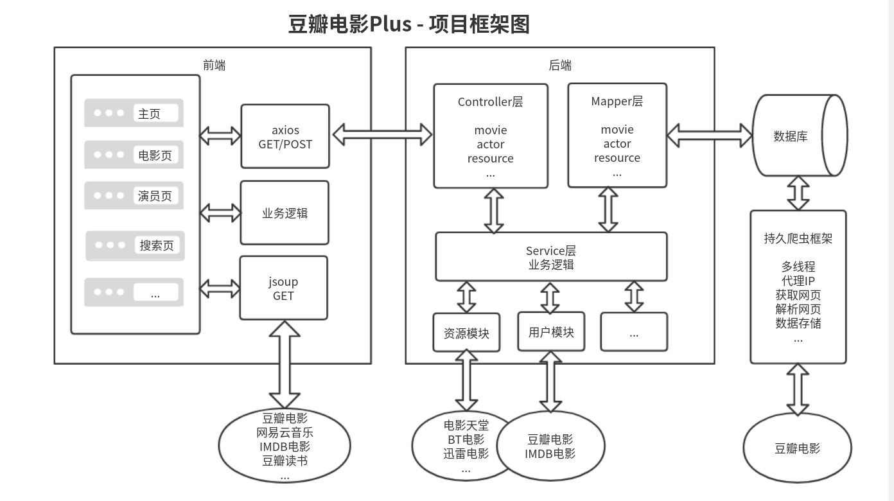
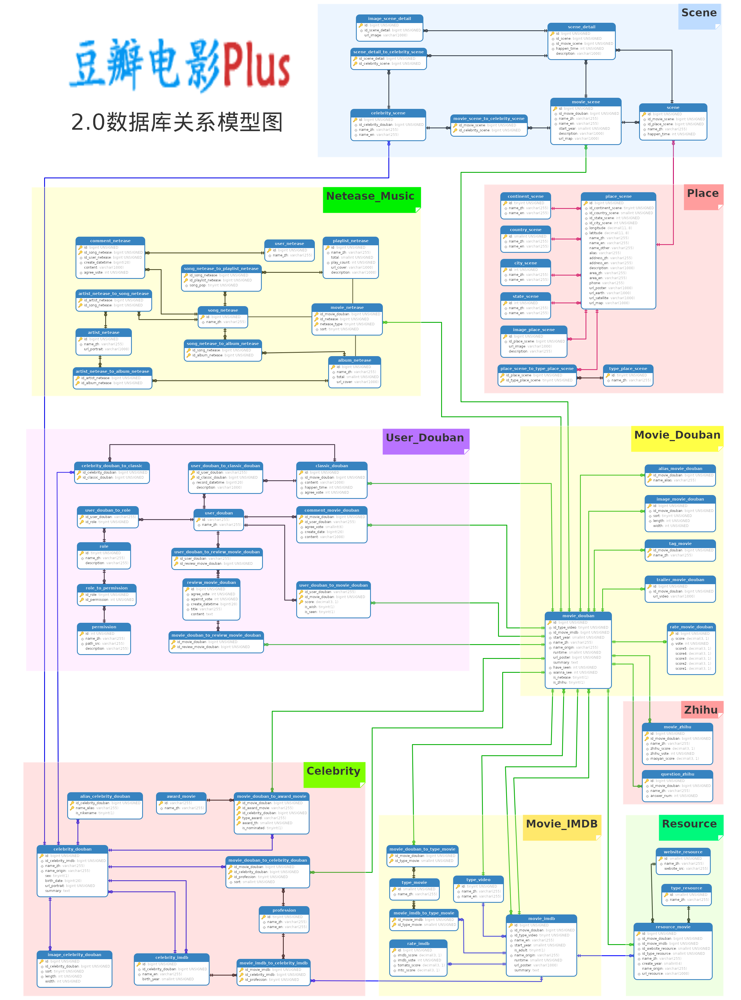

# 网站地址

https://movie.doubans.com

---

# 2.0版本开发中，1.0版本详见分支 [v1.0](https://github.com/humingk/douban_movie_plus/tree/v1.0)

# 使用方式

- 从豆瓣电影官网访问(**推荐**)

  例如:

  在二级域名 douban 后面加一个s即可跳转访问

  [https://movie.douban`s`.com/subject/1889243](https://movie.doubans.com/subject/1889243)

- 从首页访问

  https://movie.doubans.com

# 1.0项目框架图

# 数据库关系模型图

