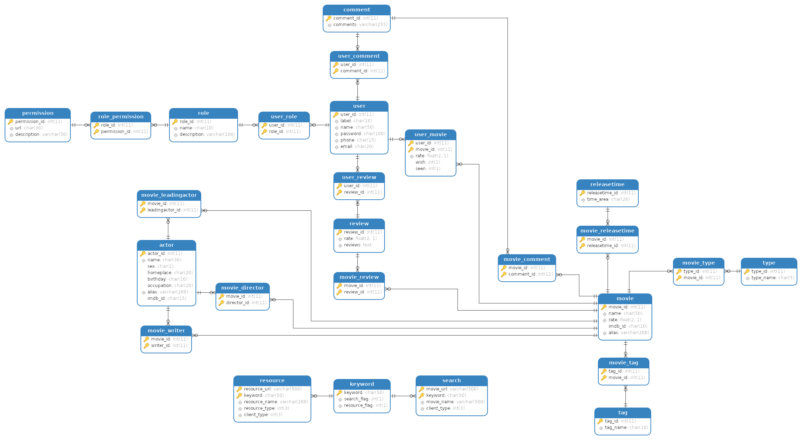

<div align="center">

</div>
<div align="center">
<a href="https://travis-ci.org/humingk/douban_movie"></a>
<a href="https://codebeat.co/projects/github-com-humingk-douban_movie-master"></a>
<a href="https://codecov.io/gh/humingk/douban_movie"></a>
<a href=""></a>
<a href=""></a>
</div>

# 项目地址

https://movie.doubans.com

# 技术栈

- 后端框架 SpringMVC + Spring + Mybatis
- 后端服务器 Tomcat
- 前端框架 Vue
- 前端服务器 Nginx
- 权限认证 Shiro
- 数据库 MySQL
- 持久爬虫 Python - Request
- 实时爬虫 Java - Jsoup 

# 使用方式

- 从首页访问

  https://movie.doubans.com

- 从豆瓣电影官网访问(**推荐**)

  例如:

  在二级域名 douban 后面加一个s即可跳转访问

  [https://movie.douban`s`.com/subject/1889243](https://movie.doubans.com/subject/1889243)

  ​	

# 安装方式

## ssm 安装

### 环境

- SpringMVC+Spring+Mybatis

- [Gradle](https://gradle.org/releases/)

### 克隆仓库

```bash
git clone https://github.com/humingk/douban_movie

```

待续...

## vue 安装

### 环境

- [Node.js](https://nodejs.org/zh-cn/download/)
- [Vue](https://cn.vuejs.org/v2/guide/installation.html)

### 克隆仓库

```bash
git clone https://github.com/humingk/douban_movie_vue
```

### 安装依赖包

```bash
cd douban_movie_vue
npm install
```

### 启动

```bash
npm run dev
```


# SSM 目录

```
├── java
|  └── org
|     └── humingk
|        └── movie
|           ├── common                          # 工具类目录
|           |  ├── AddSession.java
|           |  ├── BtbtdyResource.java
|           |  ├── JsonUtil.java
|           |  ├── LoldyttResource.java
|           |  ├── MessageCode.java
|           |  ├── MovieAll.java
|           |  ├── Resource.java
|           |  ├── ResourceBtbtdy.java
|           |  ├── ResourceDygod.java
|           |  ├── ResourceLoldytt.java
|           |  ├── Result.java
|           |  ├── ResultMessage.java
|           |  └── WishAndSeen.java
|           ├── config                          # 配置类目录
|           |  ├── corsFilter.java
|           |  ├── DataSourceInitializer.java
|           |  └── RememberMeFilter.java
|           ├── controller                      # 控制类目录
|           |  ├── ActorController.java
|           |  ├── IndexController.java
|           |  ├── MovieController.java
|           |  ├── PeopleController.java
|           |  └── UserController.java
|           ├── entity                          # 实体类目录
|           |  ├── Actor.java
|           |  ├── Movie.java
|           |  └── ...
|           ├── exception
|           |  └── NoMovieException.java
|           ├── mapper                          # 持久层接口类目录
|           |  ├── ActorMapper.java
|           |  ├── MovieMapper.java
|           |  ├── ...
|           ├── realm                           # shiro管理类目录
|           |  └── MyRealm.java                 
|           └── service                         # 业务接口类目录
|              ├── ActorService.java
|              ├── MovieService.java
|              ├── ShiroService.java
|              └── UserService.java
|              ├── impl                         # 业务实现类目录
|              |  ├── ActorServiceImpl.java
|              |  ├── MovieServiceImpl.java
|              |  ├── ShiroServiceImpl.java
|              |  └── UserServiceImpl.java
├── resources
|  ├── log4j2.xml
|  ├── mapper                                   # 持久层对应接口sql实现目录
|  |  ├── ActorMapper.xml
|  |  ├── MovieMapper.xml
|  |  └── ...
|  ├── mybatis                                  # mybatis配置目录
|  |  ├── generatorConfig.xml
|  |  ├── jdbc.properties
|  |  └── mybatis-config.xml
|  ├── spring                                   # spring配置目录
|  |  ├── ehcache-shiro.xml
|  |  ├── spring-mapper.xml
|  |  ├── spring-mvc.xml
|  |  ├── spring-service.xml
|  |  └── spring-shiro.xml
|  └── sql                                      # mysql建表目录
|     └── douban_movie.sql
└── webapp
   ├── ...
```

# VUE 目录
```
├── App.vue                                     # 根组件
├── assets
|  └── css
├── common
├── components                                  # 公共组件目录
|  ├── celebrity.vue
|  ├── chart.vue
|  ├── home.vue
|  ├── homeDetail                               # 主页子组件目录
|  |  ├── doubanNew.vue
|  |  ├── inTheater.vue
|  |  ├── top250.vue
|  |  ├── usBox.vue
|  |  └── weekly.vue
|  ├── people.vue
|  ├── search.vue
|  ├── subject.vue
|  ├── tag.vue
|  └── top.vue
├── config.js                                   # 全局变量配置
├── main.js
└── router                                      # 路由目录
   └── index.js
```

# 数据库ER关系图


